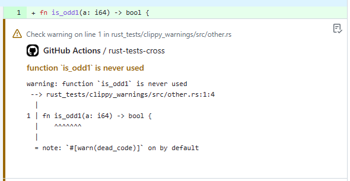

# `rs-clippy-check` Action

[](LICENSE)
[](https://github.com/clechasseur/rs-clippy-check/actions/workflows/ci.yml)

> Clippy lints in your Pull Requests

This GitHub Action executes [`clippy`](https://github.com/rust-lang/rust-clippy)
and posts all lints as annotations for the pushed commit.



## Example workflow

Note: this workflow uses [`dtolnay/rust-toolchain`](https://github.com/dtolnay/rust-toolchain) to install the most recent `nightly` clippy.

```yaml
on: push

name: Clippy check

jobs:
  clippy_check:
    runs-on: ubuntu-latest
    steps:
      - uses: actions/checkout@v3
      - uses: dtolnay/rust-toolchain@nightly
        with:
          components: clippy
      - uses: clechasseur/rs-clippy-check@v1
        with:
          args: --all-features
```

## Inputs

All inputs are optional.

| Name | Description | Type | Default |
| --- | --- | --- | --- |
| `token` | GitHub secret token | string | `${{ github.token }}` (see [here](https://docs.github.com/en/actions/security-guides/automatic-token-authentication#using-the-github_token-in-a-workflow)) |
| `toolchain` | Rust toolchain to use; override or system default toolchain will be used if omitted | string |         |
| `args` | Arguments for the `cargo clippy` command | string |         |
| `use-cross` | Use [`cross`](https://github.com/cross-rs/cross) instead of `cargo` | bool | false |
| `name` | Name of the created GitHub check. If running this action multiple times, each run must have a unique name. | string | clippy |

For extra details about the `toolchain`, `args` and `use-cross` inputs,
see [`rs-cargo` Action](https://github.com/clechasseur/rs-cargo#inputs).

**NOTE**: if your workflow contains multiple instances of the `clippy-check` action you will need to give each invocation a unique name, using the `name` property described above. Check runs must have a unique name; this prevents a later check run overriding a previous one within the same workflow.

## Limitations

***TODO: validate this section***

Due to [token permissions](https://help.github.com/en/articles/virtual-environments-for-github-actions#token-permissions),
this Action **WILL NOT** be able to post `clippy` annotations for Pull Requests from forked repositories.

This is a pretty big problem, which can be solved only by Github themselves,
see [#2](https://github.com/actions-rs/clippy-check/issues/2) for details.\
As a fallback this Action will output all clippy messages into `stdout`
and fail the result accordingly.
